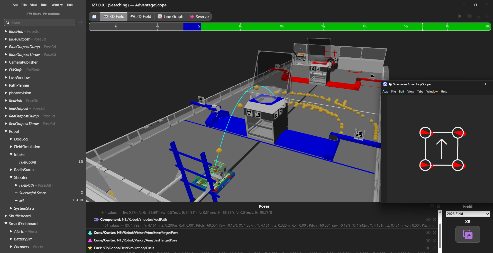

# 🤖 FRC 2026 "Rebuilt" Sezonu - Gelişmiş Oyun Simülasyonu

## 📖 Proje Hakkında

Bu depo, FRC 2026 "Rebuilt" sezonu için geliştirilmiş, yüksek doğruluklu bir robot simülasyonu ve kontrol kodunu içerir. Projenin temel amacı, gerçek bir robot olmadan yazılım geliştirme süreçlerini en üst seviyeye çıkarmak, otonom rotaları test etmek ve gelişmiş görüntü işleme algoritmalarını sanal bir ortamda doğrulamaktır.

Kod tabanı, modern FRC yazılım standartlarına uygun olarak **Java** ile yazılmıştır ve fizik tabanlı simülasyonlar için sektör standardı kütüphaneleri entegre eder.

## 🚀 Temel Özellikler

Bu proje, sadece bir robotu hareket ettirmenin ötesinde, aşağıdaki gelişmiş özellikleri içerir:

### ⚙️ YAGSL Swerve Sürüşü
* Endüstri standardı **Yet Another General Swerve Library (YAGSL)** kullanılarak oluşturulmuş sağlam swerve altyapısı.
* Saha merkezli (Field-Oriented) ve robot merkezli sürüş modları.

### 🎯 Gelişmiş Fizik Simülasyonu (IronMaple/Maple-Sim)
* **Gerçekçi Çarpışmalar:** Robot, saha duvarları ve engellerle gerçekçi bir şekilde etkileşime girer; içlerinden geçmez, çarpar ve durur.
* **Projektil Fiziği:** Shooter mekanizmasından fırlatılan oyun parçaları (Fuel/Algae), gerçek fizik kurallarına (yerçekimi, hız, açı) göre havada süzülür.
* **Otomatik Skorlama:** Simülasyon ortamında hedefe (Reef) isabet eden atışlar otomatik olarak algılanır, görsel olarak yok edilir (puf!) ve skor tablosuna işlenir.

### 👁️ Görüntü İşleme ve Nişan Alma (PhotonVision)
* 2026 Reefscape sahasındaki **AprilTag**'lerin tespiti ve takibi.
* En iyi hedefin (Best Target) belirlenmesi ve **Auto-Aim** (Otomatik Nişan Alma) altyapısı için veri sağlanması.

### 📊 AdvantageScope Entegrasyonu
* Tüm telemetri verileri (odometri, hız, modül durumları) AdvantageScope ile uyumludur.
* **Canlı Görselleştirme:** Robotun tahmini konumu, gördüğü AprilTag'ler, aktif hedefi ve fırlatılan mermilerin uçuş yörüngeleri (başarılı/başarısız atış çizgileri) 3D sahada canlı olarak izlenebilir.

### 🛣️ Otonom ve Rotalama (PathPlanner)
* Karmaşık otonom rotaların oluşturulması için PathPlanner entegrasyonu.
* Yol üzerinde belirli noktalarda Intake veya Shooter çalıştırmak için "Named Commands" ve "Event Markers" desteği.

## 🛠️ Kullanılan Teknolojiler (Tech Stack)

* [WPILib Java](https://docs.wpilib.org/en/stable/) - Temel robot kontrol çerçevesi.
* [YAGSL (Yet Another General Swerve Library)](https://yagsl.gitbook.io/yagsl/) - Swerve sürüş kütüphanesi.
* [IronMaple (Maple-Sim)](https://github.com/Shenzhen-Robotics-Alliance/Maple-Sim) - Yüksek sadakatli FRC fizik simülasyon motoru.
* [PhotonVision](https://docs.photonvision.org/en/latest/) - Görüntü işleme ve AprilTag tespiti.
* [AdvantageScope](https://github.com/Mechanical-Advantage/AdvantageScope) - Veri görselleştirme ve log analizi.
* [PathPlanner](https://pathplanner.dev/) - Otonom rota planlama.

## 💻 Simülasyonu Çalıştırma

1.  Bu depoyu klonlayın ve VS Code ile açın.
2.  Gerekli tüm vendor kütüphanelerinin (YAGSL, PhotonVision, PathPlanner vb.) yüklü olduğundan emin olun.
3.  VS Code'da `ctrl + shift + p` tuşuna basıp " Simulate Robot Code" seçeneğini çalıştırın.
4.  Simülasyon GUI'si açıldığında:
    * Robotu **Teleoperated** veya **Autonomous** moduna alın.
5.  **AdvantageScope**'u açın, simülasyona bağlanın ve "3D Field" sekmesinden robotu, mermileri ve vision hedeflerini izlemeye başlayın!

---
