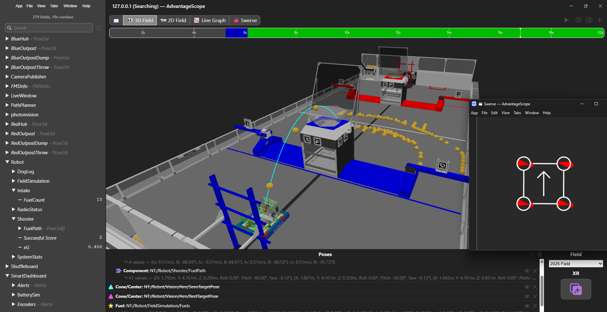

# 🤖 FRC 2026 "Rebuilt" Sezonu - Gelişmiş Oyun Simülasyonu + Saha Kodları 
### FRC Team 9043 – Valkyrie

[🇹🇷 Türkçe](#-türkçe) | [🇬🇧 English](#-english)

---

# 🇹🇷 Türkçe

## 📖 Proje Hakkında

FRC 2026 "Rebuilt" sezonu için geliştirilmiş, yüksek doğruluklu bir robot simülasyonu ve kontrol kodunu içerir. Projenin temel amacı, gerçek bir robot olmadan yazılım geliştirme süreçlerini en üst seviyeye çıkarmak, otonom rotaları test etmek ve gelişmiş görüntü işleme algoritmalarını sanal bir ortamda doğrulamaktır.

Kod tabanı, modern FRC yazılım standartlarına uygun olarak **Java** ile yazılmıştır ve fizik tabanlı simülasyonlar için sektör standardı kütüphaneleri entegre eder.

## 🚀 Temel Özellikler

Bu proje, sadece bir robotu hareket ettirmenin ötesinde, aşağıdaki gelişmiş özellikleri içerir:

### ⚙️ YAGSL Swerve Sürüşü
* Endüstri standardı **Yet Another General Swerve Library (YAGSL)** kullanılarak oluşturulmuş sağlam swerve altyapısı.
* Saha merkezli (Field-Oriented) ve robot merkezli sürüş modları.

### 🎯 Gelişmiş Fizik Simülasyonu (IronMaple/Maple-Sim)
* **Gerçekçi Çarpışmalar:** Robot, saha duvarları ve engellerle gerçekçi bir şekilde etkileşime girer; içlerinden geçmez, çarpar ve durur.
* **Projektil Fiziği:** Shooter mekanizmasından fırlatılan oyun parçaları (Fuel/Algae), gerçek fizik kurallarına (yerçekimi, hız, açı) göre havada süzülür.
* **Otomatik Skorlama:** Simülasyon ortamında hedefe (Reef) isabet eden atışlar otomatik olarak algılanır, görsel olarak yok edilir (puf!) ve skor tablosuna işlenir.

### 👁️ Görüntü İşleme ve Nişan Alma (PhotonVision)
* 2026 Reefscape sahasındaki **AprilTag**'lerin tespiti ve takibi.
* En iyi hedefin (Best Target) belirlenmesi ve **Auto-Aim** (Otomatik Nişan Alma) altyapısı için veri sağlanması.

### 📊 AdvantageScope Entegrasyonu
* Tüm telemetri verileri (odometri, hız, modül durumları) AdvantageScope ile uyumludur.
* **Canlı Görselleştirme:** Robotun tahmini konumu, gördüğü AprilTag'ler, aktif hedefi ve fırlatılan mermilerin uçuş yörüngeleri (başarılı/başarısız atış çizgileri) 3D sahada canlı olarak izlenebilir.

### 🛣️ Otonom ve Rotalama (PathPlanner)
* Karmaşık otonom rotaların oluşturulması için PathPlanner entegrasyonu.
* Yol üzerinde belirli noktalarda Intake veya Shooter çalıştırmak için "Named Commands" ve "Event Markers" desteği.

## 🛠️ Kullanılan Teknolojiler (Tech Stack)

* [WPILib Java](https://docs.wpilib.org/en/stable/) - Temel robot kontrol çerçevesi.
* [YAGSL (Yet Another General Swerve Library)](https://yagsl.gitbook.io/yagsl/) - Swerve sürüş kütüphanesi.
* [IronMaple (Maple-Sim)](https://github.com/Shenzhen-Robotics-Alliance/Maple-Sim) - Yüksek sadakatli FRC fizik simülasyon motoru.
* [PhotonVision](https://docs.photonvision.org/en/latest/) - Görüntü işleme ve AprilTag tespiti.
* [AdvantageScope](https://github.com/Mechanical-Advantage/AdvantageScope) - Veri görselleştirme ve log analizi.
* [PathPlanner](https://pathplanner.dev/) - Otonom rota planlama.

## 💻 Simülasyonu Çalıştırma

1.  Bu depoyu klonlayın ve VS Code ile açın.
2.  Gerekli tüm vendor kütüphanelerinin (YAGSL, PhotonVision, PathPlanner vb.) yüklü olduğundan emin olun.
3.  VS Code'da `ctrl + shift + p` tuşuna basıp " Simulate Robot Code" seçeneğini çalıştırın.
4.  Simülasyon GUI'si açıldığında:
    * Robotu **Teleoperated** veya **Autonomous** moduna alın.
5.  **AdvantageScope**'u açın, simülasyona bağlanın ve "3D Field" sekmesinden robotu, mermileri ve vision hedeflerini izlemeye başlayın!

---

## 📋 Yapılacaklar

* 9043 Valkyrie'nin 2026 robot modeli güncellencek.
* Pathplanner Pathleri yarışmaya uygun düzenlenicek.
* Apriltag Aimer kalibre edilcek.

---

# 🇬🇧 English

## 📖 About the Project

This project contains a high-accuracy robot simulation and control code developed for the FRC 2026 "Rebuilt" season. The main purpose of the project is to maximize software development processes without a physical robot, test autonomous paths, and validate advanced vision processing algorithms in a virtual environment.

The codebase is written in **Java** in accordance with modern FRC software standards and integrates industry-standard libraries for physics-based simulations.

## 🚀 Key Features

This project goes beyond simply moving a robot and includes the following advanced capabilities:

### ⚙️ YAGSL Swerve Drive
* A robust swerve infrastructure built using the industry-standard **Yet Another General Swerve Library (YAGSL)**.
* Supports both Field-Oriented and Robot-Oriented drive modes.

### 🎯 Advanced Physics Simulation (IronMaple/Maple-Sim)
* **Realistic Collisions:** The robot interacts realistically with field walls and obstacles; it does not pass through them, but collides and stops.
* **Projectile Physics:** Game pieces (Fuel/Algae) launched from the shooter mechanism travel according to real physics rules (gravity, velocity, angle).
* **Automatic Scoring:** Shots that hit the target (Reef) in the simulation environment are automatically detected, visually removed (puff!), and recorded on the scoreboard.

### 👁️ Vision Processing and Aiming (PhotonVision)
* Detection and tracking of **AprilTags** on the 2026 Reefscape field.
* Selection of the best target (Best Target) and providing data for the **Auto-Aim** infrastructure.

### 📊 AdvantageScope Integration
* All telemetry data (odometry, speed, module states) are compatible with AdvantageScope.
* **Live Visualization:** The robot’s estimated pose, detected AprilTags, active target, and projectile flight trajectories (successful/failed shot lines) can be monitored live on the 3D field.

### 🛣️ Autonomous and Path Planning (PathPlanner)
* PathPlanner integration for creating complex autonomous routines.
* Support for "Named Commands" and "Event Markers" to trigger Intake or Shooter at specific points along a path.

## 🛠️ Tech Stack

* [WPILib Java](https://docs.wpilib.org/en/stable/) - Core robot control framework.
* [YAGSL (Yet Another General Swerve Library)](https://yagsl.gitbook.io/yagsl/) - Swerve drive library.
* [IronMaple (Maple-Sim)](https://github.com/Shenzhen-Robotics-Alliance/Maple-Sim) - High-fidelity FRC physics simulation engine.
* [PhotonVision](https://docs.photonvision.org/en/latest/) - Vision processing and AprilTag detection.
* [AdvantageScope](https://github.com/Mechanical-Advantage/AdvantageScope) - Data visualization and log analysis.
* [PathPlanner](https://pathplanner.dev/) - Autonomous path planning.

## 💻 Running the Simulation

1.  Clone this repository and open it with VS Code.
2.  Ensure that all required vendor libraries (YAGSL, PhotonVision, PathPlanner, etc.) are installed.
3.  In VS Code, press `Ctrl + Shift + P` and run the "Simulate Robot Code" command.
4.  When the simulation GUI opens:
    * Switch the robot to **Teleoperated** or **Autonomous** mode.
5.  Open **AdvantageScope**, connect to the simulation, and start monitoring the robot, projectiles, and vision targets from the "3D Field" tab!

---

## 📋 TODO

* Update the 2026 robot model of 9043 Valkyrie.
* Adjust PathPlanner paths to be competition-ready.
* Calibrate the AprilTag Aimer.
